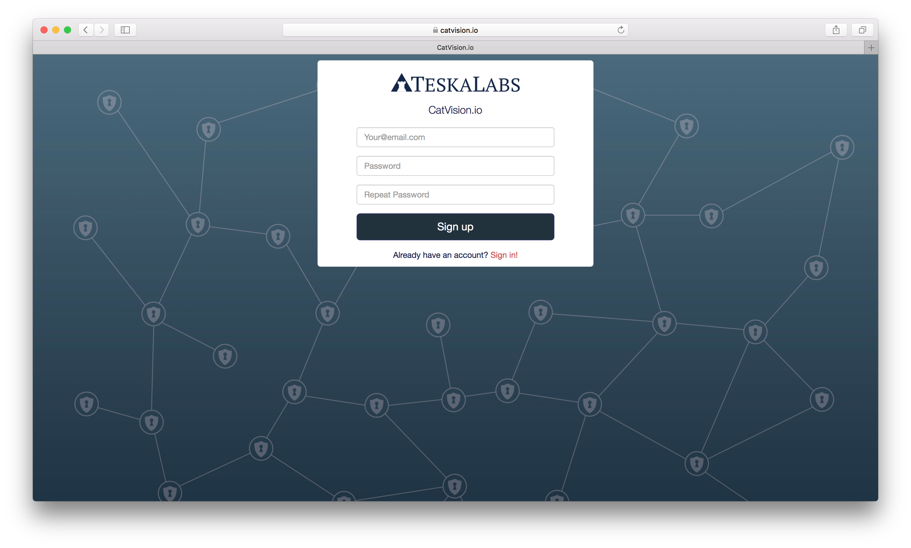
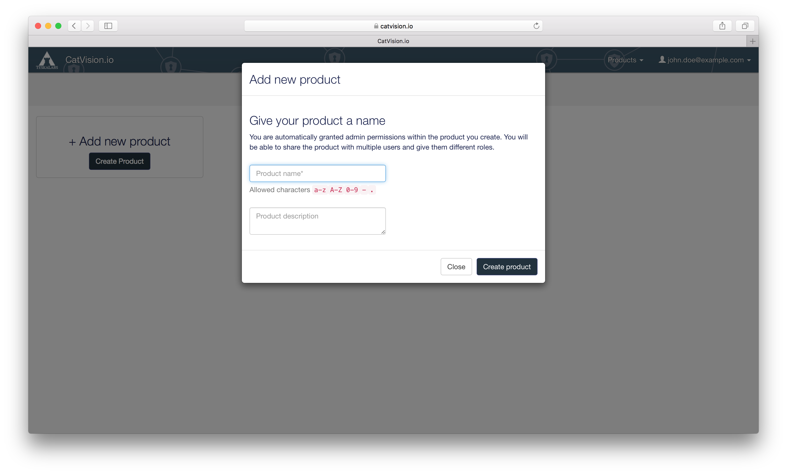
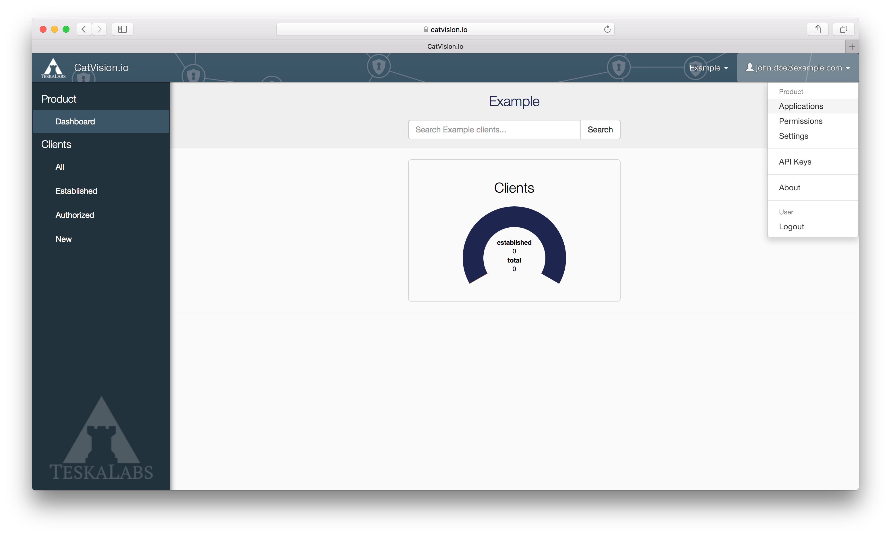
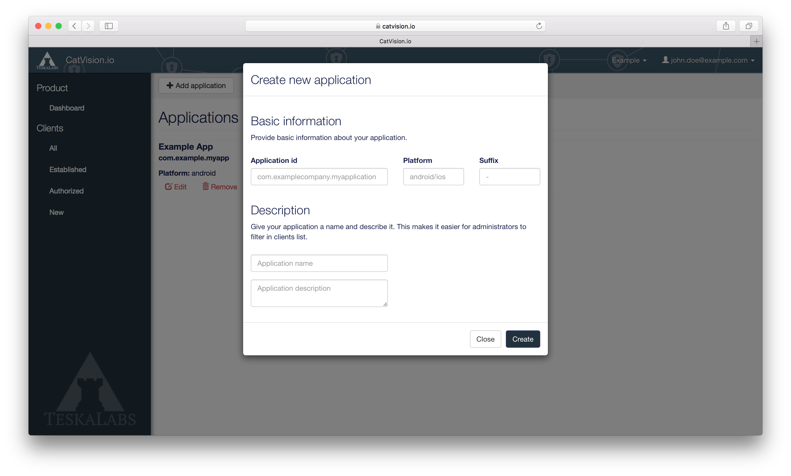
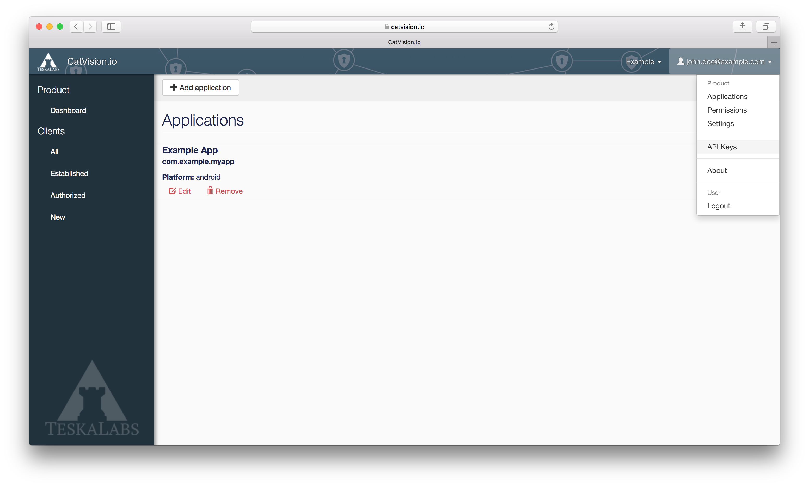

### CatVision.io

CatVision.io is where you **manage** your **API keys** and connected devices. You can view screens of your devices on this portal or you can do it with the CatVision Screen component. Either way you will first need to **register at CatVision.io** ([https://catvision.io/register](https://catvision.io/register))

#### New Product

After you register you will be prompted to "**Add new product**". You can understand a **Product** as a *namespace* for your applications.

**E. g.:** Let's say you have two applications: *"Auction for Buyers"* and *"Auction for Sellers"*. Then you could create a **Product** named *Auction*.

#### Register your application

You need to register an application that you want to use with CatVision.

* In the dropdown menu at the upper right corner of the screen go to **Applications**
* Click **+ Add application** and provide the required information - **application id**, **platform**, **name**.

> It is required to enter the real actual application id and platform for remote access to work!!

**Example:**

- **Application ID**: com.example.auction.buyers
- **Platform**: android
- **Suffix**: *(leave empty)*
- **Name**: Auction App for Buyers

#### Create an API key

API key is needed for your backend to authenticate to  Remote Access Portal.

* In the dropdown menu at the upper right corner of the screen click **API Keys**
* Click **+ New API Key**, give it a name, check the role **Readonly** and click **Create**
* Copy and save the generated API key

The **API key** is to be kept **PRIVATE**! You can store it to your backend configuration file.

