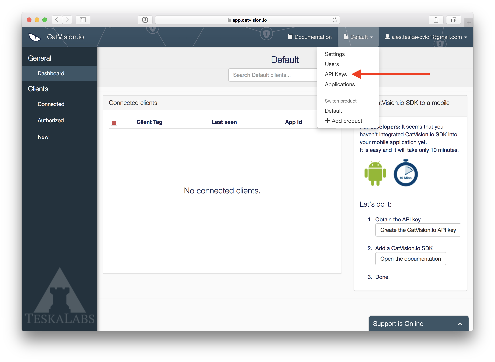

### CatVision.io

CatVision.io is a web application where you **manage** your connected clients and  **API keys**. You also display a remote screens of your mobile apps on this portal. You will first need to **register at CatVision.io** \([https://catvision.io/register](https://catvision.io/register)\)

#### New Product

After you register you will be prompted to "**Add new product**". You can understand a **Product** as a _namespace_ for your applications.

**E. g.:** Let's say you have two applications: _"Auction for Buyers"_ and _"Auction for Sellers"_. Then you could create a **Product** named _Auction_.  

#### Create an API key

API key is needed for your backend to authenticate to  Remote Access Portal.

* In the dropdown menu at the upper right corner of the screen click **API Keys**
* Click **+ New API Key**, give it a name, check the role **Readonly** and click **Create**
* Copy and save the generated API key

The **API key** is to be kept **PRIVATE**! You can store it to your backend configuration file.

