# CatVision

CatVision is a set of components that makes it possible to securely transfer screen, mouse and keyboard events to your mobile and IoT device.

<div style="text-align: center">
	<a href="assets/Catvision.svg"></a>
</div>

1. Your device equipped with [**SeaCat Android SDK**](https://s3.amazonaws.com/resources.seacat.mobi/releases/SeaCatClient_Android_v1611-rc-2-release.aar) and  [**CatVision SDK**](https://s3.amazonaws.com/resources.seacat.mobi/releases/tlra-v1611-rc-2-release.aar) connects to the **SeaCat Gateway**
2. The backend of your web application uses an **API key** to request a time-limited **Auth Token** from **CatVision.io API**, which is then passed to the [**CatVision Screen** (TODO: link to aar)](catvision-screen.md) component.
3. **Websocket Proxy** authenticates websocket connection from the **CatVision Screen** and establishes a connection to the device via **SeaCat Gateway.**

## Getting Started

Here's a quick how-to that gets your app CatVision-enabled, up and running. Click *"detailed step-by-step"* to get a more detailed 

### 1. Create an API key at CatVision.io ([detailed step-by-step](./))

Create an account at [https://catvision.io/register](https://catvision.io/register). After that, do:

- **create new product**
- **register your application**
- **create an API key**

### 2. Integrate CatVision SDK into your Android app ([detailed step-by-step](./))

Note that this how-to is a **minimum setup** for your Android application to have `CatVision` integrated. To integrate `CatVision` *by the book* follow the [detailed step-by-step](./)

Let us say we have an **Android Project** called `Example Project` with an **application** called `Example`

#### Dependency


Download the `cvio-v1705-rc.1-release.aar` and put it in `yourproject/yourapp/aars`

```
$ cd /path/to/exampleproject/example
$ mkdir aars 
$ cd aars
$ wget https://s3.amazonaws.com/resources.seacat.mobi/releases/cvio-v1705-rc.1-release.aar
```

In the application's `build.gradle` add `maven` repository and set up `com.teskalabs.cvio` as a dependency:

```
repositories {
	jcenter()
	flatDir {
		dirs 'libs'
	}
}
dependencies {
    compile {name: "cvio-v1705-rc.1-release", ext:"aar"}
}
```

#### Initialize
Initialize `CatVision` and `SeaCatClient` in your `Application` object's `onCreate()`

```
public class ExampleApp extends Application
{
	@Override
	public void onCreate()
	{
		super.onCreate();
		CatVision.initialize();
		SeaCatClient.initialize(getApplicationContext());
	}
```

#### Custom device ID
To enable CatVision to identify your device with your own ID, initialize `SeaCatClient` like this:

```
SeaCatClient.initialize(getApplicationContext(), (Runnable) null);
```

And then once you have your device ID available put that in the `CSR` so your ID gets automatically paired with the CatVision device ID.

```
String customId = getCustomId();
SeaCatClient.setCSRWorker(new Runnable() {
	public void run() {
		CSR csr = new CSR();
		csr.setUniqueIdentifier(customId);
		try {
			csr.submit();
		} catch (IOException e) {
			Log.e(SeaCatInternals.L, "Exception in CSR.createDefault:", e);
		}
	}
});
```

#### Make sure SeaCat is initialized

Create `CatVision` object. Make sure `SeaCatClient` is **initialized** before you start capturing screen. Use the following `stateChecker` runnable to check for `SeaCatClient` state.

```
public class MainActivity extends AppCompatActivity {
	Handler handler;
	Runnable stateChecker;

	@Override
	protected void onCreate(Bundle savedInstanceState) {
		catvision = CatVision.CreateOrGet(this);
		
		handler = new Handler();
		stateChecker = new Runnable()
		{
			@Override
			public void run()
			{
				String state = SeaCatClient.getState();
				if ((state.charAt(3) == 'Y') && (state.charAt(4) == 'N') && (state.charAt(0) != 'f')) {
					isSeaCatClientInitialized = true;
				}
				else {
					handler.postDelayed(this, 500);
				}
			}
		};
		stateChecker.run();
	}
```

#### Capture screen with CatVision

Start capturing screen. **SeaCatClient must be initialized at this point**

```
public class MainActivity extends AppCompatActivity {
	private int CATVISION_REQUEST_CODE = 100;
	
	...

	@Override
	protected void onActivityResult(int requestCode, int resultCode, Intent data) {
		if (requestCode == CATVISION_REQUEST_CODE) {
			catvision.onActivityResult(this, resultCode, data);
		}
	}

	private void onStartButtonClick()
	{
		if (isSeaCatClientInitialized) {
			catvision.requestStart(this, CATVISION_REQUEST_CODE);
		}
	}
```

### 3. Integrate CatVision Screen into your web application

With your application equipped with the [**SeaCat Android SDK**](https://s3.amazonaws.com/resources.seacat.mobi/releases/SeaCatClient_Android_v1611-rc-2-release.aar) and  [**CatVision SDK**](https://s3.amazonaws.com/resources.seacat.mobi/releases/tlra-v1611-rc-2-release.aar) (read [how to include CatVision SDK in your Android project](http://www.example.com)) follow the procedure in this chapter to start using CatVision on your device.


### Initialize Remote Access

Your backend server Before you render the page \(TODO: where???\) with the Remote Access Screen, you need to generate a time limited auth token on the following address: `https://ra.teskalabs.com/api/authtoken?api_key=YOURAPIKEY`

#### PHP

```php
<?php
$ch = curl_init();
curl_setopt($ch, CURLOPT_URL, 'https:\/\/ra.teskalabs.com\/api\/authtoken?api_key=[API_KEY]');
curl_setopt($ch, CURLOPT_RETURNTRANSFER, 1);
curl_setopt($ch, CURLOPT_POST, 1);
$result = curl_exec($ch);
```

#### **Python**

```py
import requests, json
r = requests.post('https://ra.teskalabs.com/api/authtoken?api_key=[API_KEY]')
res = json.loads(r.text)
return res['auth_token']
```

\(TODO: This `[API_KEY]` is the key you generated before, ...\)

Then put the following code immediately after the body tag of your rendered page. \(TODO:

```js
<script type="text/javascript" src="https://cdn.teskalabs.com/tlra.build.js"></script>
<script type="text/javascript">
    TLRA.init({
        authToken: '[AUTH_TOKEN]',
    });
</script>
```

\(TODO: This `[AUTH_TOKEN]` is ...\)

### Create a Remote Access Screen

You need to have an existing `<canvas id='mycanvas'>`  in your DOM. Once it has loaded you can create a Remote Access Screen like this:

```js
var tlraScreen = new TLRAScreen({
    target: document.getElementById('mycanvas'),
    clientHandle: '[CLIENT_HANDLE]',
});
```

TODO: `[CLIENT_HANDLE]` is ... and I get it here and there.

TODO: Note: You can use your own client identification, described here..

