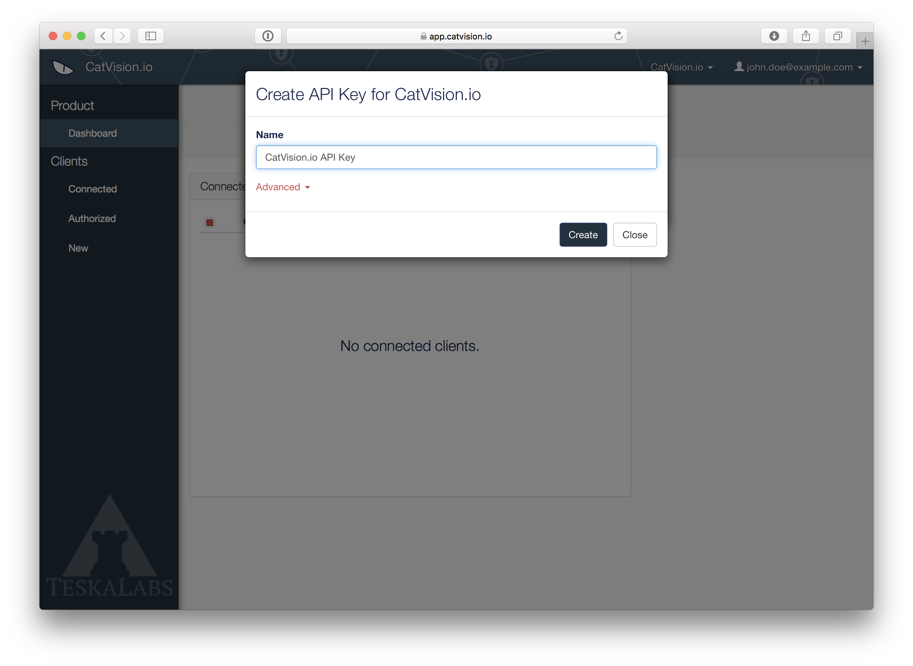
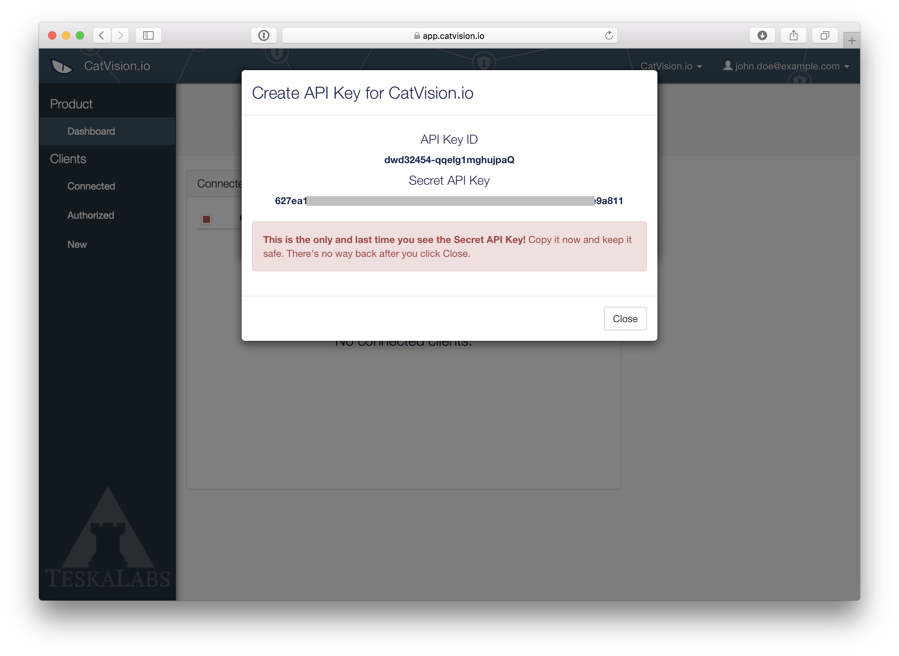

### Create an CatVision.io API key

The CatVision.io **API Key **identifies your mobile application and link it to your product registered in CatVision.io. The API key consists of two parts. **Secret API Key** and **API Key ID**_**.**_ Secret API Key is a non-public, sensitive information and you have to keep it in the secret. The Secret API Key is not stored at CatVision.io web portal. API Key ID is a public information.  The **API Key** is used for _CatVision.io SDK_ and for the _CatVision.io Display_.

#### 1. Login or register to [CatVision.io](https://app.catvision.io/)

CatVision.io is a web application where you **manage** your connected clients and  **API keys**. You also display a remote screens of your mobile apps on this portal. You will first need to **register at **[**CatVision.io**](https://app.catvision.io/). If you already have a login at CatVision.io, please sign in.

#### 2. Navigate to API keys

Go to a dropdown menu at the upper right corner of the screen and click **API Keys**

Click **+ New API Key**, give it a name, check the role **Readonly** and click **Create**

* Copy and save the generated API key

GThe **API key** is to be kept **PRIVATE**! You can store it to your backend configuration file.

