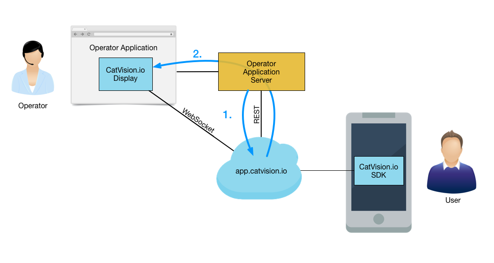
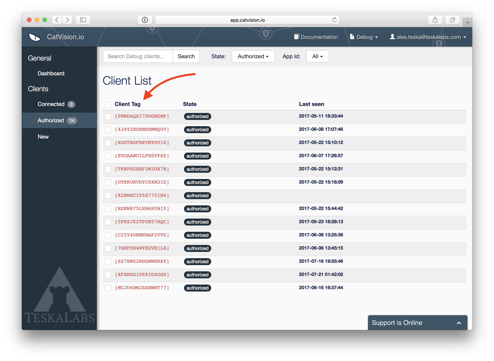

# Adding the CatVision.io Display

CatVision.io provides the remote access via [app.catvision.io](https://app.catvision.io).
Additionally, it offers the option to integrate the component _CatVision.io Display_ into third-party applications. 
Operators can then use remote access directly from existing tools such as Salesforce (CRM) or ZenDesk (Customer support).

_CatVision.io Display_ is an HTML5 component that requires JavaScript and WebSockets.

## How it works

Prior jumping to code, here is a brief intro into how _CatVision.io Display_ works.



## Prerequisites

 * _CatVision.io Secret API Key_ \(see [Catvision.io API Key](//get-started/api-key.md)\)

_Security note: We recommend to generate a dedicated API Key for each CatVision.io Display and not to share it. If one API Key get compromised, only one integration will be affected._

## 1. Obtain the authorization token

The _CatVision.io Display_ is authorized for remote access by a time limited `AUTHORIZATION_TOKEN`. This authorization token has to be obtained by _Operator Application Server_ (this is your application backend code) using _Secret API key_ \(`SECRET_API_KEY`\) from a _app.catvision.io_ API via a REST call. The authorization token is an opaque string. The authorization token is valid for XX minutes and the application has to obtain a new token after a timeout.

The relevant _app.catvision.io_ API endpoint is available at `https://app.catvision.io/api/authorization-token`.  
You need to send a POST request to this API endpoint with the `SECRET_API_KEY` variable. See an template of JSON body of the request:

```json
{
    "secret_api_key": [SECRET_API_KEY]
}
```

The _app.catvision.io_ API endpoint responds with a following response in JSON format (the authorization_token is of course different for each call):

```json
{
    "ok": 1,
    "authorization_token": "88e52eebd7c992b3e95597596996e693_1502538423.52.61d94fb4b845b8b25181fd1b375513905c61f5a80e706481eb052fc6",
}
```


Here are examples of how to fetch the authorization token using some of the popular languages.

### PHP

```php
<?php
$url = 'https://app.catvision.io/api/authorization-token';
$payload = array("secret_api_key" => '[SECRET_API_KEY]');
$options = array(
    'http' => array(
        'method'  => 'POST',
        'header' => "Content-Type: application/json\r\n",
        'content' => json_encode($payload)
    )
);
$context = stream_context_create($options);
$r = file_get_contents($url, false, $context);
$res = json_decode($r);
$authorization_token = $res->{'authorization_token'};
```

### Python

This example uses `requests` [module](http://docs.python-requests.org/en/master/).

```py
import requests, json
url = "https://app.catvision.io/api/authorization-token"
payload = { "secret_api_key": [SECRET_API_KEY] }
headers = {'Content-Type': 'application/json'}
r = requests.post(url, headers = headers, data = json.dumps(payload))
res = json.loads(r.text)
authorization_token = res['authorization_token']
```

### curl

```
$ curl \
--data '{"secret_api_key": "[SECRET_API_KEY]"}' \
	-H "Content-Type: application/json" \
	https://app.catvision.io/api/authorization-token
```

## 2. Include CatVision.io Display

Load the _CatVision.io Display_ component:

```html
<head>
    ...
    <script type="text/javascript" src="https://app.catvision.io/get/cvio.min.js"></script>
    ...
</head>
```

Put this initialization code immediately after the `<body>` tag.
This code must be generated by your application backend code with an `AUTHORIZATION_TOKEN` obtained in a first step.

```html
<body>
	<script type="text/javascript">
		CVIO.init({authorizationToken: '[AUTHORIZATION_TOKEN]'});
	</script>
...
```

## 3. Display a remote screen

Now, assuming an existing `<canvas id='cviocanvas'>` in a DOM of your HTML page, this is how you instantiate a _CatVision.io Display_ and connect it to a remote client application identified by `[CLIENT_TAG]`.
The client tag is a unique identification of a remote app provided by _CatVision.io_, you can obtain it via a CatVision.io SDK call. The client tag has always 16 characters plus two for brackets.
Here is an example of client tag: `[GMYDQMRQGIYGCMBS]`

```html
<canvas id='cviocanvas'>
...
<script type="text/javascript">
	var cvioDisplay = new CVIODisplay({
		target: document.getElementById('cviocanvas'),
		clientTag: '[CLIENT_TAG]',
	});
	cvioDisplay.connect();
</script>
```


A client tag is shown also at [app.catvision.io](https://app.catvision.io):



*Note: If you are looking for your own identification of the remote screen app, visit a Custom ID chapter to learn more.*
