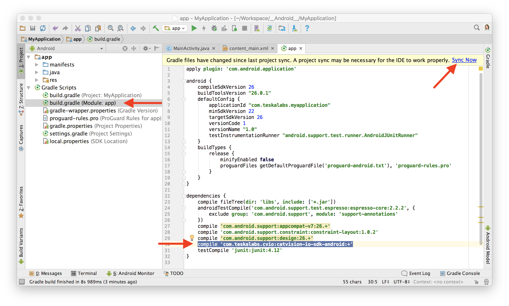
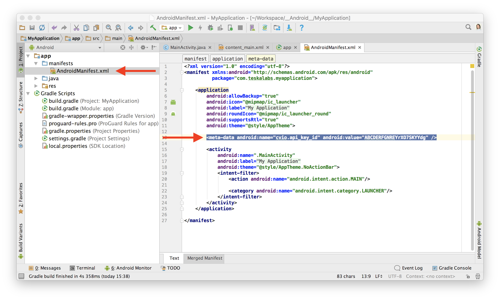
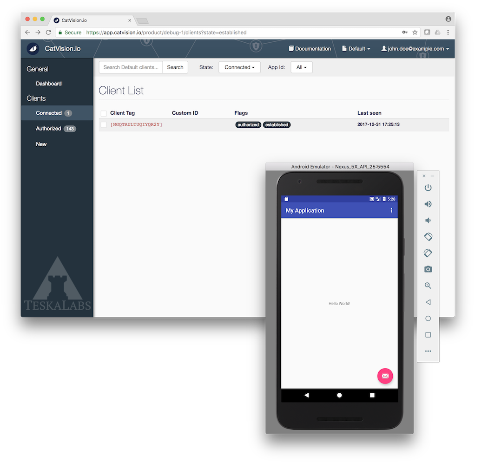

# Adding a CatVision.io SDK into an Android app

In this section we describe how to integrate a CatVision.io SDK into an Android application so that an operator can access it remotely.

## Prerequisities

* A source code of the Android application
* Android Studio
* _CatVision.io API Key ID_ \(see [Catvision.io API Key](//get-started/api-key.md)\)
* Android 5.0 \(API level 21\) or newer
* An Android permission `android.permission.INTERNET` to [perform network operations](https://developer.android.com/training/basics/network-ops/connecting.html)

## Add a CatVision.io SDK dependency

Insert a following line into `dependencies` section of your Android application `build.gradle` and press 'Sync Now'. It will download an _CatVision.io SDK_ from [JCenter](https://bintray.com/teskalabs/CatVision.io/catvision-io-sdk-android) and integrate it into the app source code.

```
compile 'com.teskalabs.cvio:catvision-io-sdk-android:+'
```



The CatVision.io SDK is now added to your Android application.

## Initialization

CatVision.io SDK has to be initialized during an application start. It is done by adding an initialization one liner into a `onCreate()` method of an `Application` class.

Open a Java source file of your application class and add a `import com.teskalabs.cvio.CatVision;` line and also `CatVision.initialize(this);` line.  See following example:

```java
...
import com.teskalabs.cvio.CatVision;
...

public class MyApplication extends Application
{
    ...

    @Override
    public void onCreate()
    {
        super.onCreate();

        ...
        CatVision.initialize(this);
        ...
    }

    ...
```

The manifest also needs to contain your _CatVision.io API Key ID_ so that the application authenticates properly to a [app.catvision.io](https://app.catvision.io). See [Catvision.io API Key](//get-started/api-key.md) for more information of how to get obtain _CatVision.io API Key ID_ if you don't have one.

Open `AndroidManifest.xml` file of your Android app and add a `<meta-data android:name="cvio.api_key_id" ...>` line:

```xml
<application ...>

...
<meta-data android:name="cvio.api_key_id" android:value="[CatVision.io API Key ID]" />
...

</application>
```

_Note:_ Make sure your application specifies an Android permission `android.permission.INTERNET` to [perform network operations](https://developer.android.com/training/basics/network-ops/connecting.html)

```xml
<manifest ...>

    ...
    <uses-permission android:name="android.permission.INTERNET" />
    ...

</manifest>
```



Congratulations! Now your application is integrated with CatVision.io SDK.

## Start a screen sharing

The application needs to implement start and stop actions of CatVision.io screen sharing. In this example we are going to implement start and stop buttons in the options menu.

Add the following code to the Activity class:

```java
...
import com.teskalabs.cvio.CatVision;
...


public class MyActivity extends Activity {

    private CatVision catvision;

    private final int menuItemStartScreenShareId = 1101;
    private final int menuItemStopScreenShareId = 1102;
    private final int CATVISION_REQUEST_CODE = 1103;

    ...

    @Override
    protected void onCreate(Bundle savedInstanceState) {

        ...
        // Obtain a CatVision.io SDK reference
        catvision = CatVision.getInstance();
        ...

    }

    ...

    @Override
    public boolean onPrepareOptionsMenu(Menu menu)
    {
        menu.clear();
        int menuGroup1Id = 1100;

        if (!catvision.isStarted()) {
            menu.add(menuGroup1Id, menuItemStartScreenShareId, 1, "Share screen");
        } else {
            menu.add(menuGroup1Id, menuItemStopScreenShareId, 1, "Stop sharing");
        }

        return super.onPrepareOptionsMenu(menu);
    }

    ...

    @Override
    public boolean onOptionsItemSelected(MenuItem item)
    {
        ...

        if (item.getItemId() == MENU_START_SCREEN_SHARE) {
            catvision.requestStart(this, CATVISION_REQUEST_CODE);
            return true;
        }

        else if (item.getItemId() == MENU_STOP_SCREEN_SHARE) {
            catvision.stop();
            return true;
        }

        ...

        return super.onOptionsItemSelected(item);
    }

    ...

    @Override
    protected void onActivityResult(int requestCode, int resultCode, Intent data) {
        if (requestCode == CATVISION_REQUEST_CODE) {
            catvision.onActivityResult(this, resultCode, data);
            return;
        }

        super.onActivityResult(requestCode, resultCode, data);
    }
```

Screen sharing function is ready. You can compile the application now and start it.

When screen sharing is started in the mobile apps, you should see the connected client at [app.catvision.io](https://app.catvision.io):



