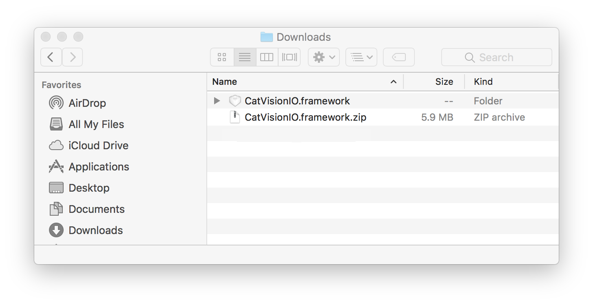
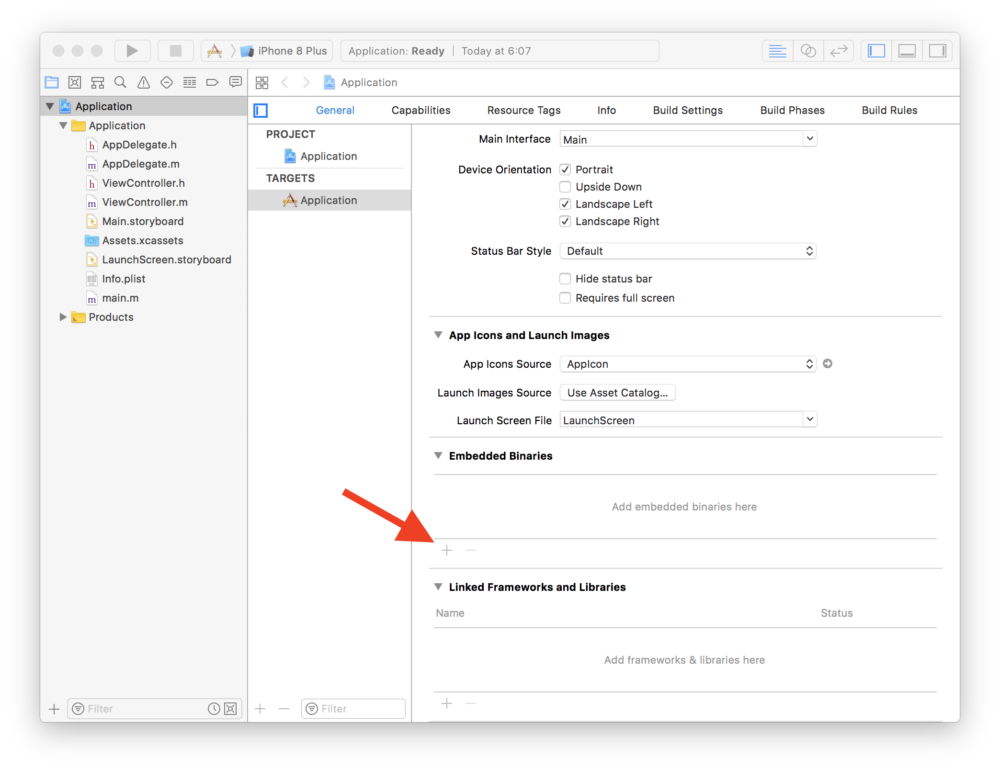
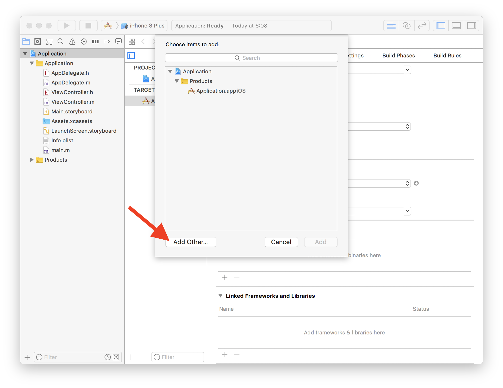
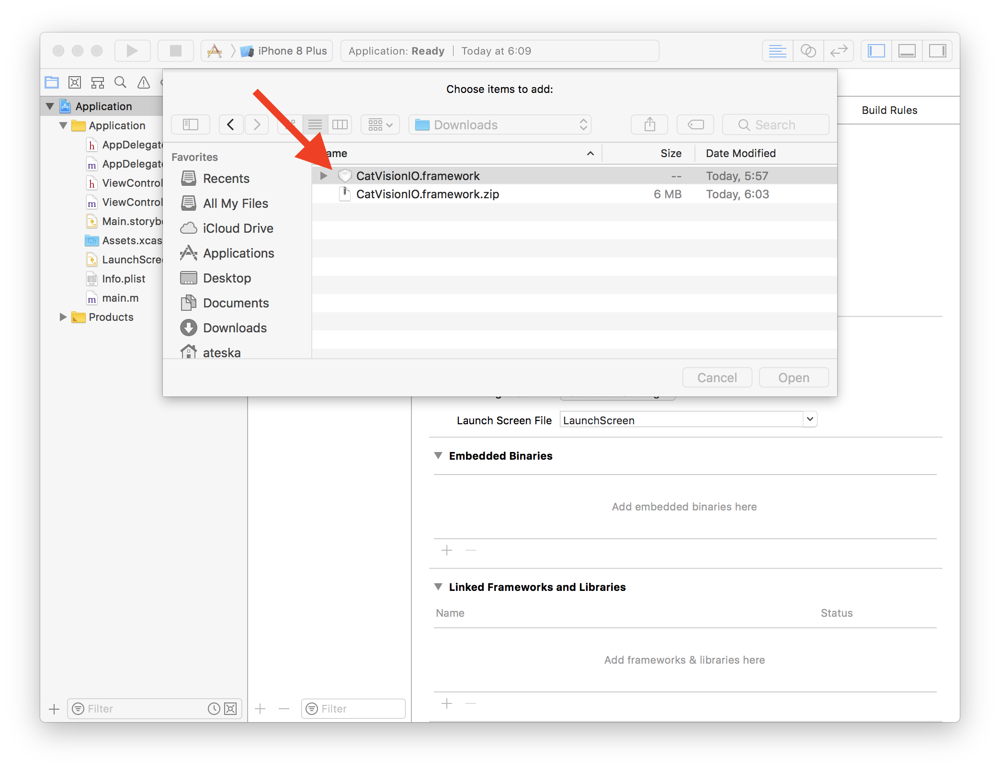
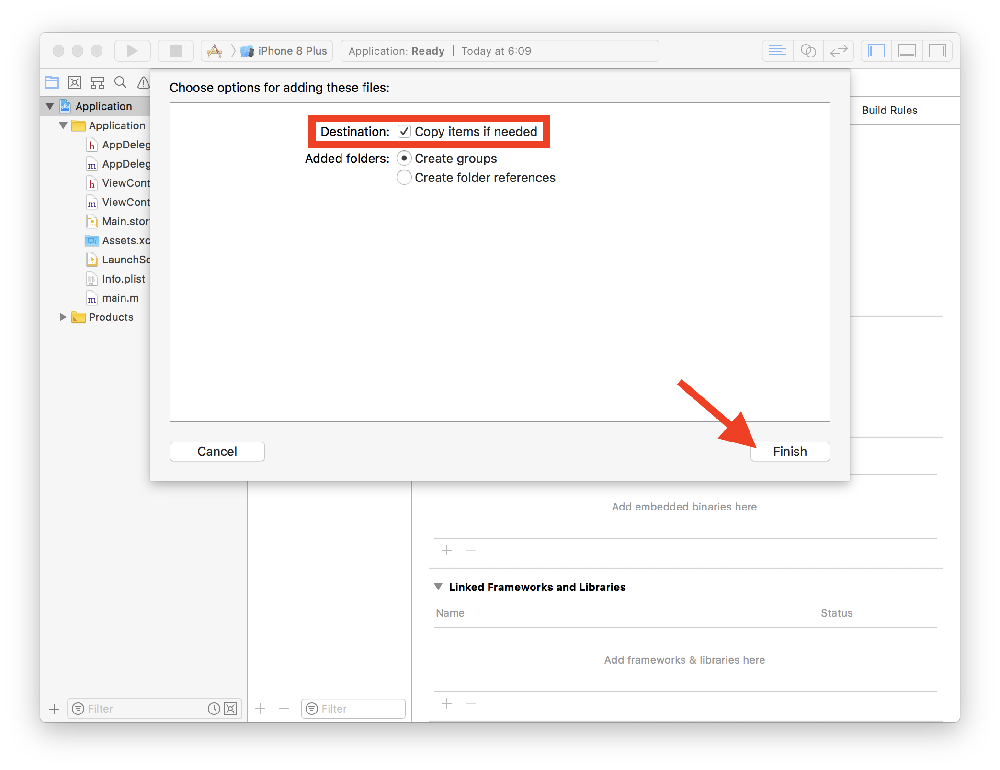
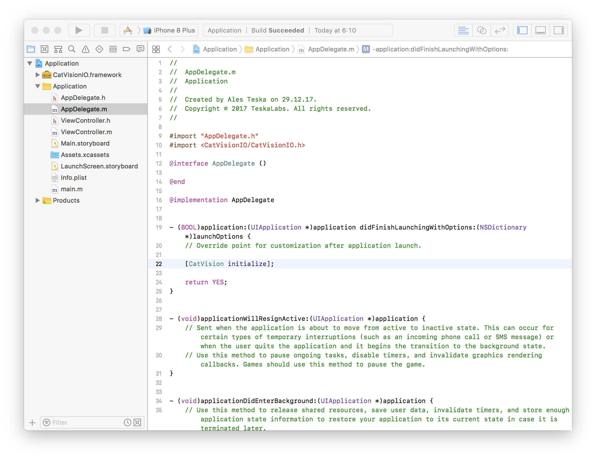
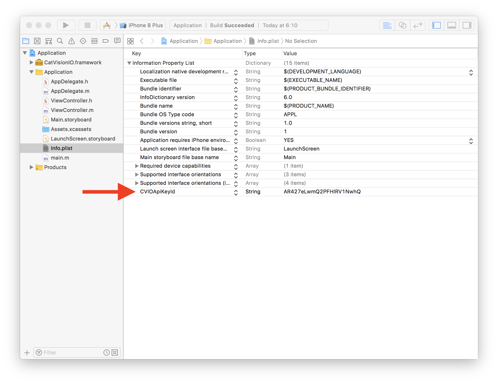
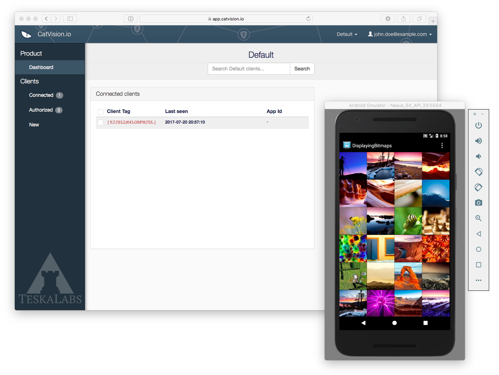

# Adding a CatVision.io SDK into an iOS application

In this section we describe how to integrate a CatVision.io SDK into an iOS application so that an operator can access it remotely.

## Prerequisities

* A source code of the iOS application
* XCode \(9.0+ is tested\)
* _CatVision.io API Key ID_ \(see [Catvision.io API Key](//get-started/api-key.md)\)

_Remark about iOS version requirement:_ Apple added a screen capturing functionality into iOS 11 \(autumn 2017\). Older versions of iOS do not support screen sharing.

## Add a CatVision.io SDK

Download [CatVision.io SDK for iOS](https://www.catvision.io/get/CatVisionIO.framework.zip) and unzip downloaded ZIP archive. The archive contains `CatVisionIO.framework`.



Open your iOS app project with XCode and go to _General_ configuration. Scroll down to "Embedded Binaries" and press "+" button.



Select "Add Other ..."



Select previously prepared `CatVisionIO.framework` a press "Open".



Ensure that "Copy items if needed" is checked. It means that `CatVisionIO.framework` will be copied into XCode project. Finally press "Finish" to complete integration procedure. Now you may delete the downloaded ZIP archive and unzipped `CatVisionIO.framework`.



The CatVision.io SDK is now added to your iOS application.

## Initialization

CatVision.io SDK has to be initialized during an application launch. It is done by adding an initialization one liner into a `didFinishLaunchingWithOptions` method of an `AppDelegate` class.

Open a source code file of your application delegate, it typically called `AppDelegate.m`. Add `#import <CatVisionIO/CatVisionIO.h>` into import section in the beginning of the source file and `[CatVision initialize];` into `didFinishLaunchingWithOptions` method.

See following example:

```
...
#import <CatVisionIO/CatVisionIO.h>
...

@implementation AppDelegate
    ...

    - (BOOL)application:(UIApplication *)application didFinishLaunchingWithOptions:(NSDictionary *)launchOptions {

        ...
        [CatVision initialize];
        ...
    }

    ...
```

Now your app should look like this:



_CatVision.io API Key ID _has to be added into the _information property list file_ \(or `Info.plist` for short\) of the iOS app so that the application authenticates properly to [catvision.io](https://app.catvision.io). See [Catvision.io API Key](//get-started/api-key.md) for more information of how to get obtain _CatVision.io API Key ID_ if you don't have one.

Open `Info.plist` file of your iOS app and _add row_ from a context menu. The _Key_ is `CVIOApiKeyId`, the type is a String and the value is the _CatVision.io API Key ID_.



## Start a screen sharing

The application needs to implement start and stop actions of CatVision.io screen sharing. In this example we are going to implement start and stop buttons in the options menu.

Add the following code to the Activity class:

```java
...
import com.teskalabs.cvio.CatVision;
...


public class MyActivity extends Activity {

    private CatVision catvision;

    private final int menuItemStartScreenShareId = 1101;
    private final int menuItemStopScreenShareId = 1102;
    private final int CATVISION_REQUEST_CODE = 1103;

    ...

    @Override
    protected void onCreate(Bundle savedInstanceState) {

        ...
        // Obtain a CatVision.io SDK reference
        catvision = CatVision.getInstance();
        ...

    }

    ...

    @Override
    public boolean onPrepareOptionsMenu(Menu menu)
    {
        menu.clear();
        int menuGroup1Id = 1100;

        if (!catvision.isStarted()) {
            menu.add(menuGroup1Id, menuItemStartScreenShareId, 1, "Share screen");
        } else {
            menu.add(menuGroup1Id, menuItemStopScreenShareId, 1, "Stop sharing");
        }

        return super.onPrepareOptionsMenu(menu);
    }

    ...

    @Override
    public boolean onOptionsItemSelected(MenuItem item)
    {
        ...

        if (item.getItemId() == MENU_START_SCREEN_SHARE) {
            catvision.requestStart(this, CATVISION_REQUEST_CODE);
            return true;
        }

        else if (item.getItemId() == MENU_STOP_SCREEN_SHARE) {
            catvision.stop();
            return true;
        }

        ...

        return super.onOptionsItemSelected(item);
    }

    ...

    @Override
    protected void onActivityResult(int requestCode, int resultCode, Intent data) {
        if (requestCode == CATVISION_REQUEST_CODE) {
            catvision.onActivityResult(this, resultCode, data);
            return;
        }

        super.onActivityResult(requestCode, resultCode, data);
    }
```

Screen sharing function is ready. You can compile the application now and start it.

When screen sharing is started in the mobile apps, you should see the connected client at [app.catvision.io](https://app.catvision.io):



